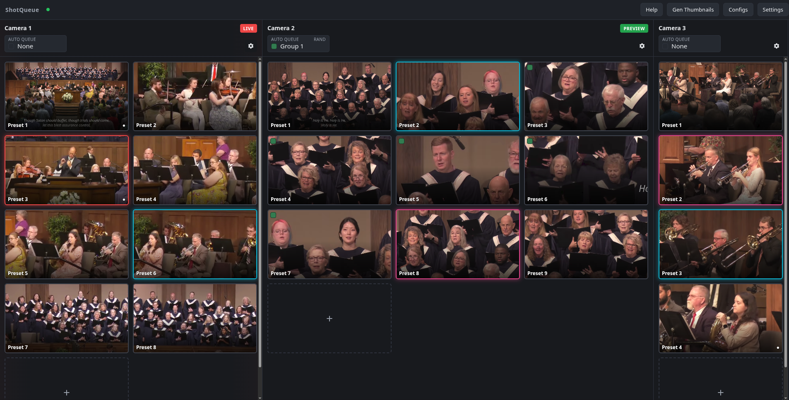

# shotqueue

A web server to assist in automated PTZ-camera preset triggering. For live-production/streaming setups (church, small studio, etc).

## Testing / debugging with mocks

VSCode compound **"shotqueue+mocks"** (`.vscode/launch.json`) launches everything at once:

| Process              | Port(s)               |
|----------------------|------------------------|
| Backend (Delve)      | 8080 (`--port`)        |
| Frontend (Vite)      | 5173                    |
| Mock Controller      | 5000                    |
| Mock ATEM            | UDP 9910 (fixed) + web UI 9000 |
| Mock UE150 (x3)      | 5001, 5002, 5003        |

Or run mocks standalone via `mocks/run-*.sh` (same default ports as above).

To wire shotqueue to the mocks: in Settings, set ATEM host to `localhost` (port is fixed at
9910, not configurable). Add cameras with host `localhost` and port `5001`/`5002`/`5003`, one per
`mock-ue150` instance.

Mock ATEM's web UI (port 9000) lets you set live/preview/cut/fade to drive tally state. Mock
Controller (port 5000) is a standalone page for poking a `mock-ue150` camera directly, independent
of shotqueue.

Note: all of backend, mock-controller, and mock-ue150 default to port 8080 if run standalone
without an explicit port — only run one at a time on that port, or override with `--port=`.

## Known limitations

See `todo.txt`.
